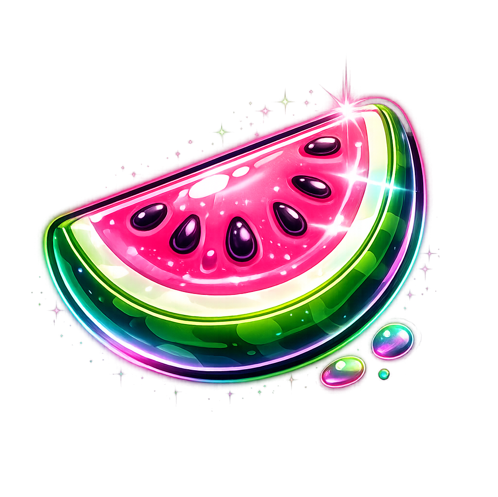
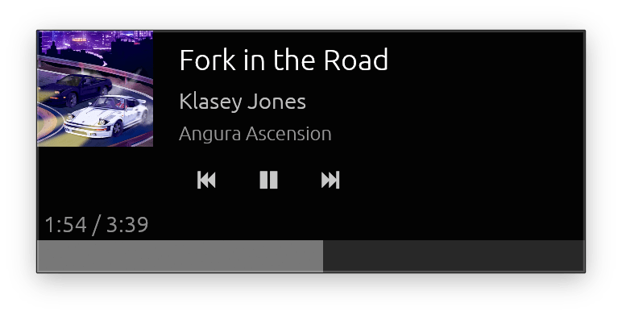

<p align="center">
  
</p>

<h1 align="center">Floating Fruit</h1>

<p align="center">
  A tiny, frameless, always-on-top <strong>Apple Music now-playing widget</strong> for macOS.
</p>

---

Floating Fruit sits in the corner of your screen and shows what's currently playing in Apple Music — album art, track info, playback controls, and a seekable progress bar — without getting in the way.

<p align="center">
  
</p>

## Features

- **Always on top** — stays visible over other windows while you work
- **Frameless & draggable** — clean look, drag anywhere to reposition
- **Album art** — extracted from Music.app with an in-memory LRU cache
- **Scrolling text** — long titles, artists, and album names marquee automatically
- **Playback controls** — previous, play/pause, next
- **Seekable progress bar** — click or drag to jump to any position
- **Smooth position tracking** — interpolates between polls so the progress bar never stutters
- **Click artwork to reveal** — opens the track in Music.app

## Requirements

- **macOS** (uses AppleScript to talk to Music.app — will not work on Linux or Windows)
- **Rust** toolchain (edition 2024, requires Rust 1.85+)
- **Apple Music** (the native Music.app, not the web player)

## Building

```bash
cargo build --release
```

The release profile is configured for a small binary (`strip`, `opt-level = "z"`, LTO).

### macOS `.app` bundle

The `Cargo.toml` includes `[package.metadata.bundle]` for use with [cargo-bundle](https://github.com/burtonageo/cargo-bundle):

```bash
cargo install cargo-bundle
cargo bundle --release
```

This produces a `Floating Fruit.app` in `target/release/bundle/osx/`.

## Running

```bash
cargo run
```

A small 340×150 window appears. If Apple Music is playing, the widget shows the current track immediately. If not, it displays "Nothing playing" until you start something.

## How it works

1. A **background thread** runs `osascript` commands to query Music.app (~1 poll/sec) and extract artwork.
2. Track metadata (title, artist, album, position, duration) is sent back to the UI thread via an `mpsc` channel.
3. The **egui/eframe** UI renders the widget, interpolating playback position between polls for a smooth progress bar.
4. Album artwork is written to a temp file by AppleScript, loaded and downscaled (≤400px), then cached as a GPU texture keyed by album.

## Project structure

```
src/
├── main.rs      # entry point, window setup
├── app.rs       # application state, background polling, art cache
├── music.rs     # AppleScript integration with Music.app
├── texture.rs   # image loading and GPU texture upload
└── ui.rs        # layout, controls, progress bar, scrolling labels
```

## License

This project is licensed under the [GNU General Public License v3.0](LICENCE.txt).
